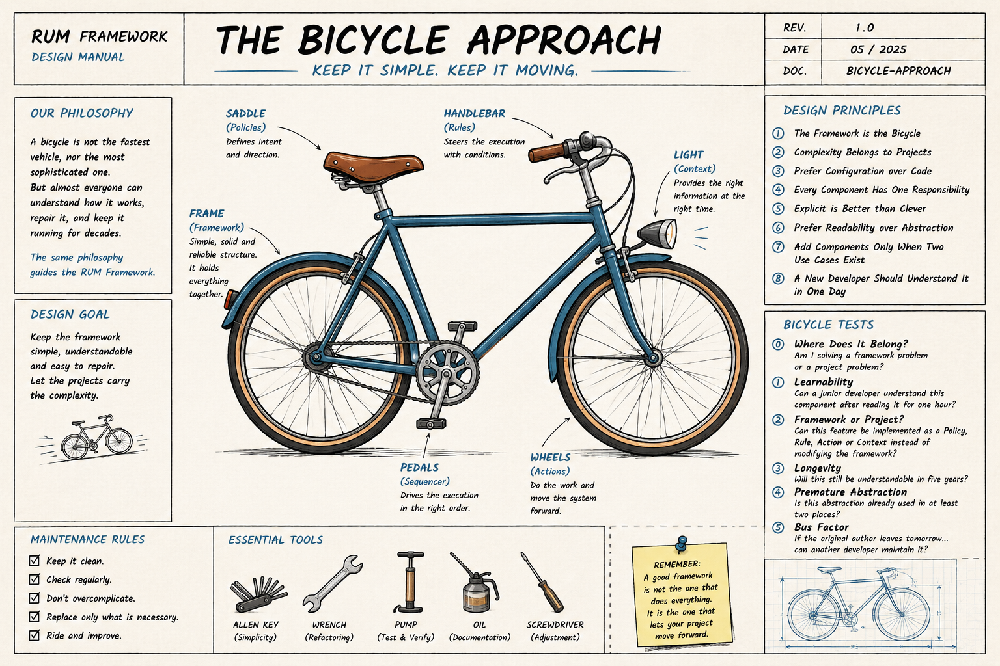

# The Bicycle Approach 
## A design philosophy for sustainable software in Research Infrastructures

<p align="center">
  
</p>

The Bicycle Approach is the design philosophy behind the [RUM Framework](README.md).

It was inspired by a simple observation.

Research Infrastructures often operate software systems for decades, while the people maintaining them continuously change. New developers join the team, experienced developers move to other projects, students become researchers, and knowledge is gradually transferred over time.

> Research Infrastructures require software architectures whose complexity remains proportional to the long-term maintainability of the organization.

In this environment, software sustainability depends not only on technology, but also on how easily the system can be understood, maintained, repaired, and extended by people who did not originally write it.

For this reason, the framework itself should remain intentionally simple.

Like a bicycle, it should be understandable by almost everyone, easy to repair, and capable of serving its purpose for many years.

The complexity of the application should live in the project—not in the framework.

The following design principles summarize this philosophy.

### 1. The Framework is the Bicycle

The framework must remain small, understandable, and easy to repair.

If a feature makes the framework more complex, reconsider the design.

### 2. Complexity Belongs to Projects

Business logic must never migrate into the framework.

Policies, Rules, Actions and Context are where complexity belongs.

### 3. Prefer Configuration over Code

If behavior can be expressed through configuration, avoid modifying Python code.

### 4. Every Component Should Have One Responsibility


**Policies** express intent.

**Rules** organize execution.

**Actions** perform one task.

**Modules** encapsulate reusable logic.

The framework orchestrates them.


### 5. Explicit is Better than Clever

Never infer user intentions if they can be expressed explicitly.

```
Good

ENABLED: true`
```
```
Less good:

 if everything_is_null():
 
``` 

### 6. Prefer Readability over Abstraction

Future maintainers will read the code far more often than they will write it.

Readable code is preferred over sophisticated architectures.

### 7. Add Components Only When Two Use Cases Exist

Do not introduce generic abstractions before they are actually needed.

If only one Action needs a helper, keep it local.

Generalize only after reuse naturally appears.

### 8. A New Developer Should Understand It in One Day

The framework should minimize the learning curve.

Simple code is an investment in long-term sustainability.


# Bicycle tests
The design principles presented above describe the philosophy behind the Bicycle Approach.

The following Bicycle Tests are intended as practical questions to ask before introducing a new feature or modifying the framework.

They are not strict rules.

Instead, they provide a simple decision-making checklist to help preserve the long-term maintainability of the framework.

If several tests raise concerns, the proposed design should probably be reconsidered.

### Bicycle Test #0 — Before You Start
Before modifying the framework, ask yourself:

"Am I solving a framework problem...

...or a project problem?"

### Bicycle Test #1 — Learnability

Can a junior developer understand this component after reading it for one hour?

If not, simplify it.

### Bicycle Test #2 — Framework or Project?

Can this feature be implemented as a Policy, Rule, Action or Context instead of modifying the framework?

### Bicycle Test #3 — Longevity

Will this still be understandable in five years?

### Bicycle Test #4 — Premature Abstraction

Is this abstraction already used in at least two places?

If not, don't create it.

### Bicycle Test #5 — Bus Factor

If the original author leaves tomorrow...

can another developer maintain it?

---

# Closing Thought

The Bicycle Approach does not seek to build the most sophisticated framework.

It seeks to build a framework that can still be understood, maintained, and trusted many years after its original authors have left.

For Research Infrastructures, this is not a limitation.

**It is a design objective.**

The Bicycle Approach is not about writing less software.

It is about writing software that lasts longer.