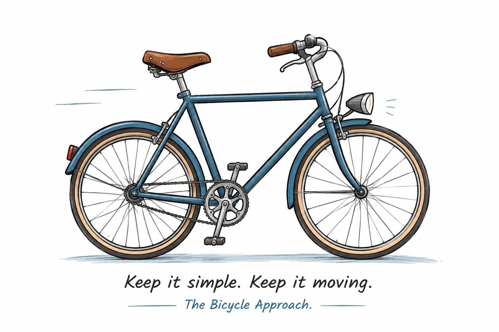

# RUM Framework

RUM (Rule Manager) Framework is a lightweight and modular engine to define, manage, and execute **policies**, **rules**, and **actions** in a configurable and reusable way, clearly separating decision logic from execution logic.

This implementation represents the core engine of the framework and is designed to support policy-driven workflows in automation, data processing, and service-oriented contexts.

The framework is described in detail in the technical report:

> *Fares M., Carluccio I., Danecek P., et al.*
> **INGV RUM — A Lightweight Rule Manager Framework**, Rapporti Tecnici INGV, 508 (2025).
> DOI: 10.13127/rpt/508
 

# RUM: Design Philosophy

> *Keep the framework simple. Let the policies do the work.*

RUM was developed to address a practical challenge commonly faced by Research Infrastructures (RIs): software systems often remain operational for many years, while the people maintaining them continuously change.

New developers join the team, experienced developers move to different projects, students become researchers, and responsibilities evolve over time. In this environment, software sustainability depends not only on functionality or performance, but also on how easily the system can be understood, maintained, and extended.

**Simplicity is not a limitation of RUM**

**It is one of its fundamental design principles.**

## The Bicycle Principle
>
>
> 
> <p align="center">
>  
> </p>
>
> <p align="center"> RUM is intentionally designed to remain simple.</p>
> <p align="center">Complexity belongs to projects built on top of RUM, 
> not to the framework itself.</p>

The design philosophy behind RUM can be summarized with a simple metaphor.

**RUM is intentionally designed to be a bicycle.** 🚲

A bicycle is not the fastest vehicle, nor the most sophisticated one. However, almost everyone can understand how it works, repair it, and continue using it for decades.

The same philosophy guides the development of RUM.

The framework itself should remain:

- small;
- readable;
- understandable;
- maintainable;
- predictable;
- easy to extend.

The framework should remain intentionally simple.

Complexity belongs to projects built on top of RUM, not to the framework itself.

Instead, it should be expressed where it naturally belongs:

- Policies describe **what** should happen.
- Rules organize **how** the workflow is executed.
- Actions implement the domain-specific logic.
- Context describes the operational conditions under which the execution takes place.

The framework does not implement business logic. It simply orchestrates reusable components.

Projects provide the behaviour; the framework provides the orchestration.

## A Design Principle

When introducing a new feature, the first question should never be:

> *"Can this feature be implemented as a Policy, Rule or Action instead of modifying the framework?"*

Instead, the question should be:

> **"Can this be implemented without making the bicycle more complicated?"**

If the answer is yes, the framework is evolving in the intended direction.

If implementing a feature requires increasing the complexity of the framework itself, the design should be reconsidered.

Keeping the framework simple is considered more important than adding sophisticated architectural mechanisms.

This principle has guided the development of RUM from the beginning and is expected to remain valid for future evolutions of the framework.

RUM was intentionally designed around the operational reality of Research Infrastructures, where software often outlives the people who originally developed it.

---

## Motivation

In many complex systems, operational logic is often:

* hard-coded into application code,
* duplicated across multiple components,
* tightly coupled to specific workflows.

This approach makes systems hard to evolve and limits reusability.

RUM addresses this problem by introducing a configuration-driven model that:

* separates **decision logic** from **execution logic**,
* allows behavior changes without code modifications,
* promotes component reuse.

---

## Core Concepts

RUM is based on three core concepts:

* **Policy** – defines context and overall intent.
* **Rule** – expresses conditional logic.
* **Action** – represents reusable execution units.

These elements are orchestrated by the **sequencer**, which ensures a deterministic execution flow.

While Policies, Rules and Actions define the execution model, a **Context** can optionally provide execution-specific information shared by all Actions during a processing session.

---

## Policy

A **policy** is a logical container of related rules designed to represent a specific operational or functional goal.

Policies:

* group logically related rules,
* define the execution scope,
* do not execute actions directly.

Their role is to provide a higher semantic layer that guides the sequencer in executing the rules.

---

## Rule

A **rule** encapsulates a logical condition that is evaluated against input, context, or system state.

Rules:

* are evaluated sequentially by the sequencer,
* determine whether and which actions should be executed,
* can **override action configuration**.

The rule is the key connection point between the intent expressed by a policy and the concrete execution of actions.

---

## Action

An **action** is a reusable execution unit that performs a specific task, such as:

* invoking a service,
* transforming data,
* sending notifications,
* executing commands or workflow steps.

Actions are designed to be:

* generic,
* context-independent,
* configurable through parameters.

### Configuration Override

A key principle of RUM is that **action configuration can be overridden at the rule level**.

In practice:

* the action defines default parameters,
* the rule can redefine or extend these parameters,
* the same action can be reused in multiple rules and policies with different behaviors.

This mechanism prevents duplication and enables high reuse.

---

## Execution Model and Sequencer

The **sequencer** is responsible for executing policies.

Execution flow:

1. Select the policy to run
2. Iterate over the rules defined in the policy
3. Evaluate each rule against the current input
4. If the rule matches:

   * resolve the associated actions
   * apply configuration overrides
5. Execute the actions in a deterministic order

This model ensures:

* predictability,
* transparency of decision logic,
* fine-grained control over execution.

---

## Repository Structure

RUM is organized into two independent repositories:

- the **RUM Framework**, which provides the generic execution engine;
- a **Project**, which provides the domain-specific components (Policies, Rules, Actions, Contexts, etc.).

The framework is intentionally independent from any specific application. A Project repository is cloned into the `project/` directory and supplies all the elements required to execute a concrete workflow.

> RUM intentionally separates the execution engine from project-specific logic.

```
RUM Framework
│
├── build/          # build scripts and packaging
├── core/           # framework core components (sequencer, engine, session, ...)
├── example/        # example projects and tutorials
├── images/         # documentation images
├── log/            # log directory (placeholder)
├── utils/          # framework utility functions
├── README.md
└── project/        # project workspace (external repository)
    │
    ├── actions/    # project-specific Actions
    ├── config/     # Action configurations
    ├── contexts/   # execution Context definitions
    ├── modules/    # project-specific modules
    ├── policies/   # Policy definitions
    ├── rules/      # Rule definitions
    ├── utils/      # project utility functions
    └── README.md
```

The `project/` directory is intentionally left empty in the framework repository. Users should clone a compatible Project repository into this directory before running RUM.

This separation allows the framework to remain generic while enabling multiple independent projects to reuse the same execution engine.

---

## Conceptual Example

### Action (default configuration)

```yaml
name: notify_action
parameters:
  retries: 3
  timeout: 30
```

### Rule (override configuration)

```yaml
name: high_priority_rule
condition: input.priority == "high"
actions:
  - name: notify_action
    override:
      timeout: 5
```

### Policy

```yaml
name: notification_policy
rules:
  - high_priority_rule
```

During execution, the sequencer applies the rule's override to the action configuration before executing it.

---

## Project Context

RUM Framework is **only the core engine**. It requires a concrete **project** to provide rules, policies, actions, and input data to process. Without a project context, the engine does not produce any output.

For example, the [**Curation project**](https://github.com/INGV/rum-project) (or any other project) provides:

* the set of policies and rules to apply
* configuration of actions
* input data or workflow triggers

This separation allows RUM to remain flexible, reusable, and independent from specific use cases.

---

---

## Context

RUM introduces the concept of **Context**.

A Context is a read-only collection of execution-specific information shared by all Actions during a processing session.

Unlike **Policies**, **Rules**, and **Actions**, which define *what* should happen and *how* it should be executed, the Context describes *under which operational conditions* the execution takes place.

Typical information stored in a Context includes:

- issue or ticket identifiers;
- requesting organization;
- operator information;
- provenance metadata associated with versioning;
- execution options;
- project-specific parameters.

The Context is loaded once during the RUM bootstrap phase and remains immutable throughout the execution. Every Action can access it, while none is allowed to modify it.

This design keeps execution metadata separated from both the framework logic and the domain-specific logic implemented by Actions.

The Context is **not another configuration file**. It does not change the behaviour of the framework; instead, it describes the operational environment in which a Policy is executed.

> **Design Rule**
>
> The Context should describe the execution environment, never the execution logic.
>
> If a parameter changes *how* the framework behaves, it probably belongs to a **Policy**, a **Rule**, or an **Action**.
>
> If it describes *who*, *why*, or *under which conditions* a processing is performed, it belongs to the **Context**.

---

## Design Principles

RUM is built on the following principles:

* **Separation of concerns**: policies, rules, and actions have distinct responsibilities.
* **Configuration-driven behavior**: system behavior is defined via configuration.
* **Reusability**: actions are reusable and customizable.
* **Extensibility**: new rules and actions can be added without modifying the core engine.
* **Simplicity by design**: whenever possible, new functionality should be implemented by extending projects rather than increasing the complexity of the framework.


---

## References

* *INGV RUM — A Lightweight Rule Manager Framework*, Rapporti Tecnici INGV 508 (2025), DOI: 10.13127/rpt/508


